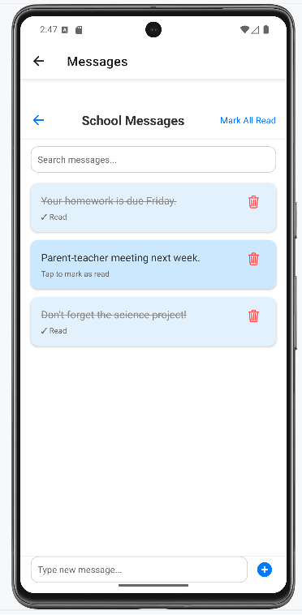

# React Native Message App Demo 

This is a mobile message demo application built with **React Native** and **TypeScript**.  
It demonstrates directories, messages, messages management.

---

## Project Structure

```
MessageApp/                      # root folder
├── App.tsx                      # App entry with NavigationContainer
├── index.ts                     # Entry point
├── app.json / package.json      # Configuration files
├── 
├── src/
│   └──assets/
│   │    └── images/             # Icons for message categories
│   │          ├── family.png
│   │          ├── work.png
│   │          ├── school.png
│   │          └── ...more icons
│   ├── data/
│   │   └── messageData.ts       # Default message data for all categories
│   ├── navigation/
│   │   └── TabNavigator.tsx     # Optional bottom tab navigation
│   └── screens/
│       ├── DirectoryScreen.tsx    # Main category directory screen
│       └── MessageListScreen.tsx  # Message list screen (search + add + delete)


```

---

## IDE Platform for Coding: Android Studio

## Github Url: https://github.com/tantss333/exercise_01.git


## 📲 How to Install and Run the App

1. **Make sure you have Node.js and Expo CLI:**  
   - install nodeJs (https://nodejs.org/en/download)
   - install expo :
         **npm install -g expo-cli**


2. **Clone this repository:**
   ```
   git clone https://github.com/tantss333/exercise_02.git
   cd exercise_02
   ``` 

3. **Install dependencies:**
   ```bash
   npm install

   ```

4. **Install Expo Navigation and AsyncStorage if not installed yet**

```bash

 npx expo install @react-navigation/native

 npx expo install @react-navigation/native-stack

 npx expo install react-native-screens react-native-safe-area-context react-native-gesture-handler react-native-reanimated

 npx expo install @react-native-async-storage/async-storage

```


5. **▶️ Running the App**
   - Be sure that load the project from the root folder, for example: **exercise_02**

   - Be sure you **connect your mobile device**(either virtual or practical) in IDE

   - via terminal:
     ```bash
     npx expo start
     ```

6. **To test**
   
   Follow the instructions showed on the terminal:

   - Press **w** to open in a Web browser
   - Press **a** to open in Android device
   - Or **scan the QR code** using the **Expo Go App** on your mobile device
   

---

## 🖼 Screenshots


|  |  |
|:--:|:--:|
| Main Page | Message List Page |

|  | 
|:--:
| Message Function (**mark, delete, add**)

---

## ✅ Features Implemented

📁 Category Browsing	6 predefined categories: Family, Work, School, Friends, Travel and Finance.

📄 Message Listing	Each category holds its own independent message set.

✅ Mark as Read / All Read	Toggle single read state or mark all as read at once.

🗑️ Delete Messages	Tap delete to remove messages (with confirm on Web).

🔍 Search Bar	Real-time filtering of visible messages.

➕ Add New Messages	Input box at bottom to add and store new messages.

💾 Local Persistence	Messages and read status stored locally using AsyncStorage

---

## ⚠ Notes

- If you're using a custom folder like `assets/`, update image paths accordingly

---

## 📌 Author

- Student: Sheng Tan  
- Student ID: 1252550